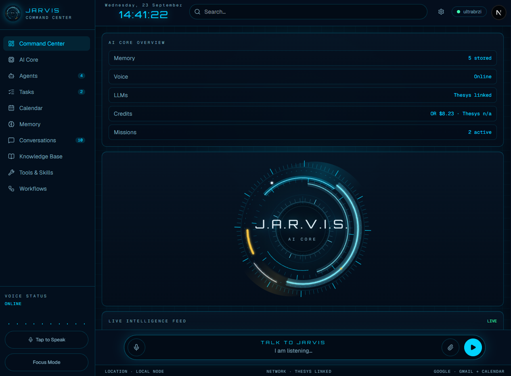

# JARVIS Command Center

Personal operator dashboard: missions, memory, and a streaming AI core with generative UI. Built with Next.js, Firebase, NextAuth, and Thesys C1.

## What JARVIS can do now

Talk in the **Talk to JARVIS** bar (or use Quick Commands / sidebar prompts). With a Thesys API key, replies stream in and can render as cards, lists, and timelines instead of a wall of text. Without the key, JARVIS still answers locally with a briefing or recalled notes.

### Missions

A mission is one piece of work for the signed-in operator: an assignment, study block, reading, project, or errand. It can name a course, a due date, a priority, notes, and tags. A lecture, class, lab, or exam sitting goes on Google Calendar, not this board. Say you want it as a mission, or pick **Recurring class or lab**, when you want that class on the board. Homework and study for the course stay missions.

JARVIS creates and updates the plan. You read the same list, and you complete or delete from the board. You can also tell him a mission is finished ("I finished the essay", "gotov esej") and he will mark that one done. He cannot delete one.

**Missions** in the sidebar opens the board: pending and completed, with search, Start, Complete, and Reopen. There is no create form. **New mission** and **Start new mission** ask JARVIS to show the ways to add one. The command center **mission timeline** is the same list, trimmed to active work plus a few completed ones.

Ask him in the Talk bar in any of three ways:

- Name the work and when it is due, and he creates it. A sentence of several obligations ("today I have to go to the gym and do the shopping", or the Croatian equivalent) becomes one mission each.
- Say only that you want a new mission, and he shows a card of options: assignment, exam and a study plan, recurring class or lab, study block, reading, project, a today or tomorrow list, or an errand. Pick one and he asks only for what is still missing.
- Ask him to plan a week or prepare for an exam that is still ahead. He proposes the set, including which sessions repeat, and creates them after you confirm.

He picks an icon and color from `app/_lib/task-appearance.ts` when he creates one. You can ask him to rename, move a due date, change the course, or stop a repeat.

A mission can repeat daily, on weekdays, or weekly on chosen days, until an optional end date. Completing it closes that occurrence and opens the next one after today, so a late complete does not pile up the days you missed. If the repeat has already ended, nothing new is added. Deleting the open card stops the series. Older completed cards stay until you delete them too.

The HUD also shows system status and a live intelligence feed of overdue and due-soon missions. Asking what to do loads the same briefing: overdue, due today, and in progress.

### Memory

- Open **Memory** in the sidebar to browse every stored note
- Add a note, search the list, or delete one
- Ask JARVIS to recall notes from that view, or tell him to remember something in the Talk bar

Header search asks JARVIS to look across missions and memory.

### Auth and data

- Sign in with Firebase email/password, or use **demo operator** in development
- Data lives in Firestore when the Admin SDK is configured
- Without Admin SDK, demo login uses a local `.data` store so you can explore the UI
- Demo login seeds sample missions and a memory note

### Google Calendar and Gmail

After you click **Connect Google** in Link status, JARVIS can:

- Create calendar events and reminders. A lecture, class, lab, seminar, or exam sitting goes here. If Google is not connected, JARVIS says so instead of putting that event on the mission board.
- List upcoming Google Calendar events
- List and read Gmail
- Send email, including images pasted or attached in the Talk bar

### WhatsApp

Click **Connect** on WhatsApp in Link status and scan the QR from the phone that owns the account (Linked devices). The same signed-in account shares that session on every phone. When the session is live, Link status says **Connected** and shows the number.

JARVIS can then:

- Read WhatsApp messages, including unread ones
- Look up contacts
- Send a message to a contact, including images pasted or attached in the Talk bar

Workflows shows the unread WhatsApp count directly under the Gmail unread card.

### Voice

The talk-bar mic and **Start Voice Chat** keep listening through pauses shorter than about two seconds. **Tap to Speak** stops after 4 seconds if you say nothing, and JARVIS is not prompted. With `OPENROUTER_API_KEY` (used first) or `OPENAI_API_KEY`, JARVIS transcribes Croatian or English automatically, speaks the reply in that language, and turns a spoken day plan such as "danas moram ići u teretanu i obaviti dućan" into separate missions. Without either key, the browser recognizer is used in Croatian or English based on the browser language.

The sidebar bars follow your voice only when one of those keys is set. That path opens the microphone and reads its level. Without a key, the browser recognizer returns text and no volume, so the bars play a fixed wobble whether you are talking or silent. Speech recognition still hears you either way.

## Not live yet

- AI Core, Agents, Knowledge Base, Tools & Skills, Workflows as standalone pages
- Host CPU / RAM / disk monitor

## How memory and tool calling work

Each Talk-bar turn loads your notes and adds a "Known about the operator" section to the system prompt. Pinned notes always go in. Newest unpinned notes follow until about 1,500 characters. Anything past that stays stored. Asking what is stored is answered from that block. JARVIS calls `recall` only to search for a specific subject that is not already listed. JARVIS follows instruction notes, applies preference notes, and treats fact notes as true unless you contradict them.
`remember` stores a note and its kind, `forget` deletes one note when you ask

Each note is `{ id, userId, text, createdAt, updatedAt, kind, pinned }`. `kind` is `fact`, `preference`, or `instruction`. Older notes with no kind are treated as facts, and a missing pin means unpinned. Notes live with the rest of your data:

- Firestore: `users/{userId}/memories/{id}` when the Admin SDK is configured
- Otherwise: `.data/jarvis-memory.json`

Three paths write the same record:

- The **Memory** tab calls `POST /api/memories`
- Saying you want something remembered in the Talk bar makes the model call the `remember` tool, which runs the same store method. The prompt tells JARVIS to translate Croatian or English into that action, so the instruction does not list both phrasings.
- The same normalized text updates the existing note instead of inserting a duplicate

`PATCH /api/memories/[id]` changes text, kind, or pin. `DELETE` removes one note. **Clear notes older than 3 months** calls `POST /api/memories/cleanup` and deletes unpinned notes whose `createdAt` is at least three months old. Pinned notes stay. The `forget` tool deletes one note when you ask JARVIS to forget it.

### What a chat turn actually sends

Every Talk-bar turn sends three things to Thesys:

1. A system prompt. After the operator's local time it includes a **Known about the operator** block built from pinned notes and recent unpinned notes. It tells JARVIS when to call `remember`, `recall`, and `forget`. It does not repeat tool triggers in both languages. One line says to translate the request, then follow the English instructions.
2. The messages in the current conversation only.
3. Tool definitions (`remember`, `recall`, `forget`, mission tools, Calendar, Gmail) with `tool_choice: auto`.

`recall` still returns at most 8 notes, newest first. With a search string it keeps notes whose text contains that string. Those results are appended to that same turn as tool messages. The next message does not include the search results again. The prompt block is rebuilt from the store on every turn, so a pin or a new note is present on the following message without another `recall`.

Saved conversations are separate. A thread is the chat transcript (`users/{userId}/chats`), not these notes. Starting a new conversation does not drop the memory block. The block is added again on the next turn.

# Speech recognition

The Web Speech API is the fallback, and it lives in app/_lib/use-speech-recognition.ts. It uses window.SpeechRecognition or window.webkitSpeechRecognition, which is Chrome and Edge’s browser recognizer. That path runs only when neither OPENROUTER_API_KEY nor OPENAI_API_KEY is loaded. With the OpenRouter key loaded, Tap to Speak never calls it. The browser records audio with MediaRecorder, sends it to /api/speech/transcribe, and OpenRouter transcribes it. The sidebar bars read that same microphone stream.

Spoken replies now use OpenRouter's Grok voice model, with the voice Rex, and the audio comes back as an MP3.

### Why the voice and the text response do not match

The text response and the spoken reply are the same Thesys reply, not two answers. The screen renders the full text response, including titles and bullets. Voice reads the explanation.

`speakableReply` in `app/_lib/c1.ts` keeps the lead-in prose, every sentence in `Text`, and `ListItem` facts such as a mission name and its due date. It drops `CardHeader` titles and subtitles, bullet marks, and props such as icon and color. List items are joined with a pause, so a mission list is heard as "Teretana. Due 22 September." A long reply is cut at a sentence boundary near 4000 characters. That string goes to `/api/speech/speak`. OpenRouter reads it with Grok voice (Rex). An OpenAI key uses `gpt-4o-mini-tts` (Onyx) instead. The speech model does not write its own reply.